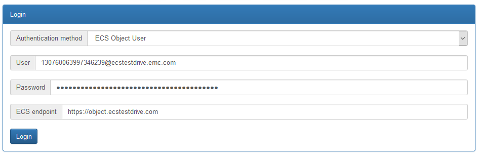
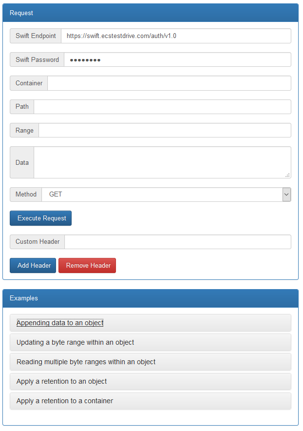

# Amazon S3, Openstack Swift and Atmos API: how to use the the most popular API calls and the ECS extensions

DellEMC Elastic Cloud Storage (ECS) is a software-defined, cloud-scale, object storage platform that combines the cost advantages of commodity infrastructure with comprehensive protocol support for unstructured (Object and File) workloads.

ECS supports several Object Storage APIs (Amazon S3, Openstack Swift, Atmos, CAS), but also extends them to provide unique capabilities (metadata search, retention, byte range update, ...).

You'll use the ECSUI web application to discover the different features. 

[ECSUI](https://github.com/djannot/ecsui) is a web application developed in Golang and leveraging AngularJS.

The goals of ECSUI are to:

- demonstrate S3 features (versioning, lifecycle policy, …) and several unique ECS capabilities using either S3 or Swift (byte range, retentions, metadata search, …)
- simplify the usage of several REST APIs (S3, Swift, Atmos, ECS)
- provide a simple UI for the ECS metadata search features

## Prerequisites

### ECS

If you don't have access to an ECS system, you can create an account on [ECS Test Drive](http://portal.ecstestdrive.com).

### ECSUI

I created a Docker container for the ECSUI application.

Pull the container image using the command below:

```
docker pull djannot/ecsui
```

You can then start the container with the following command:

```
docker run -d -p 80:80 djannot/ecsui
```

The ECSUI application can now be accessed with a web browser on port 80.



You need to select the *Object User* authentication method and indicate your credentials.

If you are using your own ECS system, then you need to indicate the corresponding endpoint (for example, *http://ip:9020*).

# Lab

## Amazon S3 API

Go to *S3 API* -> *Requests*


You will simply click on the examples.


As soon as you click one example, the different steps are displayed.


When you click on one step, all the field are already filled with the right information.

You generally don't need to indicate anything. You'll simply need to click on Execute.

Whenever you need to indicate something, you'll have a field above the *Expected Response Code* field as shown below.


You can then click on *Execute*


The response code should be displayed in green.

You can then click on it to display the response.


### Appending data to an object

> This is an ECS extension. This feature isn't available in the standard S3 API.

Appending data to an object can be very useful in many cases. For example, to append lines a log file.

On Amazon or other S3 compatible platforms, it would be necessary to send the full log file again.

### Updating a byte range within an object

> This is an ECS extension. This feature isn't available in the standard S3 API.

Updating partially an object can be very useful in many cases. For example, to modify a binary header stored at the beginning of a large file.

On Amazon or other S3 compatible platforms, it would be necessary to send the full file again.


### Reading multiple byte ranges within an object

> This is an ECS extension. This feature isn't available in the standard S3 API.

Reading multiple parts of an object can be very useful in many cases. For example, to get several video parts.

On Amazon or other S3 compatible platforms, it would be necessary to send a different request for each part.

### Apply a retention to an object

> This is an ECS extension. This feature isn't available in the standard S3 API.

Applying a retention to an object is the best way to protect data against accidental (or malicious) modifications and deletions. ECS provides compliance for both CAS and S3.

On Amazon or other S3 compatible platforms, there is no similar feature available.

### Apply a retention to a bucket

> This is an ECS extension. This feature isn't available in the standard S3 API.

Applying a retention to objects is the best way to protect data against accidental (or malicious) modifications and deletions. ECS provides compliance for both CAS and S3.

Applying a retention at the object level provides more granularity, but applying a retention at the bucket level provides the ability to modify the retention later (only increasing it if compliance is enabled at the namespace level).

On Amazon or other S3 compatible platforms, there is no similar feature available.

### Apply an expiration to a bucket

> This feature is available in the standard S3 API.

When using a standard File System, the application needs to manage the deletion of the old data.
If the application wants to delete all the data after one year, a process must be run every day and a logic must be implemented to decide what to do when a delete operation fails.

Applying an expiration to a bucket is much simpler and reliable.

Some other S3 compatible platforms don’t support this feature.

### S3 versioning

> This feature is available in the standard S3 API.

Applying a retention to an object is the best way to protect data against accidental (or malicious) modifications and deletions. If the application needs to modify objects, this is not a viable solution. In this case, using S3 versioning is recommended.

ECS supports S3 versioning for buckets created with FS access disabled.

Expiration can be configured at the bucket level to automatically delete old versions after a specific period of time (using NoncurrentVersionExpiration insteand of Expiration in the S3 lifecycle policy).

Some other S3 compatible platforms don’t support this feature.

### Metadata search

> This is an ECS extension. This feature isn't available in the standard S3 API.

When an Amazon S3 bucket is created, a user can specify metadata (system and user) to be indexed by ECS. The metadata search feature includes the following capabilities:

- Support for “<,>,<=,>=,=,!=, AND/OR”
- Sort capabilities
- Specify attributes to be returned
- Pagination support and ability to specify limits for search results

When an application is using metadata search, an external database isn’t needed anymore (at least for the corresponding queries). It reduces the complexity, operational costs (managing the database, keeping metadata in sync, …) and infrastructure costs (expensive primary storage, backup costs, …).

Very few other S3 compatible platforms have a similar capability.

### S3 Copy

> This feature is available in the standard S3 API.

S3 Copy provides the ability to create a new object using the content of an existing one, but without copying the data.

This operation is used by many applications to rename objects, but it can also be used in many other cases:

-	Creating a new bucket with some objects from another bucket
-	Creating a copy of a bucket for DR testing
-	Migrating objects from a bucket with FS disabled to a buckets with FS enabled

Some other S3 compatible platforms don’t support this feature.

## Openstack Swift API

Go to *Swift API* -> *Requests*



For the Swift API, you need to indicate the endpoint, user and password.

If you are using your own ECS system, then you need to indicate the corresponding endpoint (for example, *http://ip:9024/auth/v1.0*).

The password is a Swift password, not the Secret Key.

Everything else is working the same way as described for the Amazon S3 API.

### Appending data to an object

> This is an ECS extension. This feature isn't available in the standard Swift API.

Appending data to an object can be very useful in many cases. For example, to append lines a log file.

On Swift or other Swift compatible platforms, it would be necessary to send the full log file again.

### Updating a byte range within an object

> This is an ECS extension. This feature isn't available in the standard Swift API.

Updating partially an object can be very useful in many cases. For example, to modify a binary header stored at the beginning of a large file.

On Swift or other Swift compatible platforms, it would be necessary to send the full file again.

### Reading multiple byte ranges within an object

> This is an ECS extension. This feature isn't available in the standard Swift API.

Reading multiple parts of an object can be very useful in many cases. For example, to get several video parts.

On Swift or other Swift compatible platforms, it would be necessary to send a different request for each part.

### Apply a retention to an object

> This is an ECS extension. This feature isn't available in the standard Swift API.

Applying a retention to an object is the best way to protect data against accidental (or malicious) modifications and deletions.

### Apply a retention to a container

> This is an ECS extension. This feature isn't available in the standard Swift API.

Applying a retention to objects is the best way to protect data against accidental (or malicious) modifications and deletions.

Applying a retention at the object level provides more granularity, but applying a retention at the bucket level provides the ability to modify the retention later.

On Swift or other Swift compatible platforms, there is no similar feature available.

## Atmos API

Go to *Atmos API* -> *Requests*


For the Atmos API, you need to indicate the endpoint and subtenant.

If you are using your own ECS system, then you need to indicate the corresponding endpoint (for example, *http://ip:9022*).

The same Secret Key is used for the Amazon and S3 APIs.

Everything else is working the same way as described for the Amazon S3 API.

### Appending data to an object

> This is an ECS extension. This feature isn't available in the standard Atmos API.

Appending data to an object can be very useful in many cases. For example, to append lines a log file.

On Atmos, it would be necessary to send the full log file again.

### Updating a byte range within an object

> This is an ECS extension. This feature isn't available in the standard Atmos API.

Updating partially an object can be very useful in many cases. For example, to modify a binary header stored at the beginning of a large file.

On Atmos, it would be necessary to send the full file again.

### Apply a retention to an object

> This is an ECS extension. This feature isn't available in the standard Atmos API.

Applying a retention to an object is the best way to protect data against accidental (or malicious) modifications and deletions.

On Atmos, applying a retention to an object can only be done using metadata driven policies.

###	Apply a retention to a bucket

> This is an ECS extension. This feature isn't available in the standard Atmos API.

Applying a retention to objects is the best way to protect data against accidental (or malicious) modifications and deletions.

Applying a retention at the object level provides more granularity, but applying a retention at the bucket level provides the ability to modify the retention later (only increasing it if compliance is enabled at the namespace level).

On Atmos, retentions can also be applied at the subtenant level using a policy

### Simple objectspace test

The goal of this test is to show the compatibility of ECS with the Atmos objectspace API

### Create an object with a specific object Id

The goal of this test is to show the ability to migrate an object from Atmos to ECS with the Atmos objectspace API