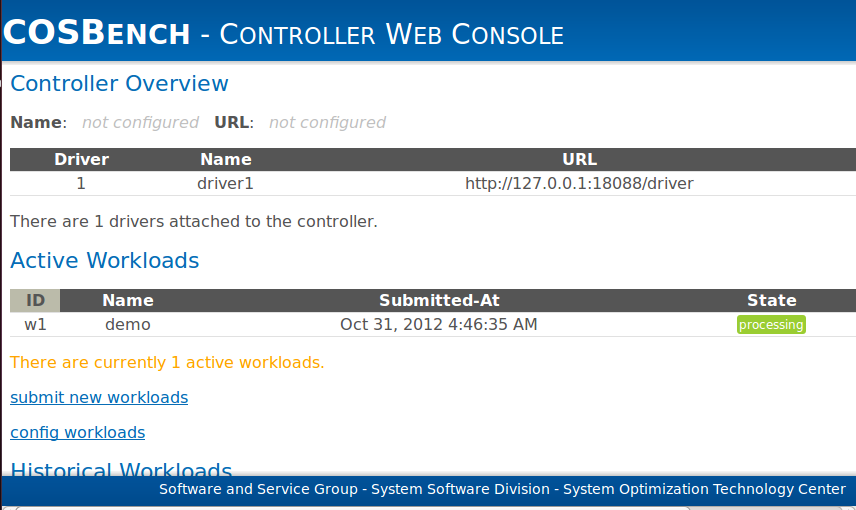
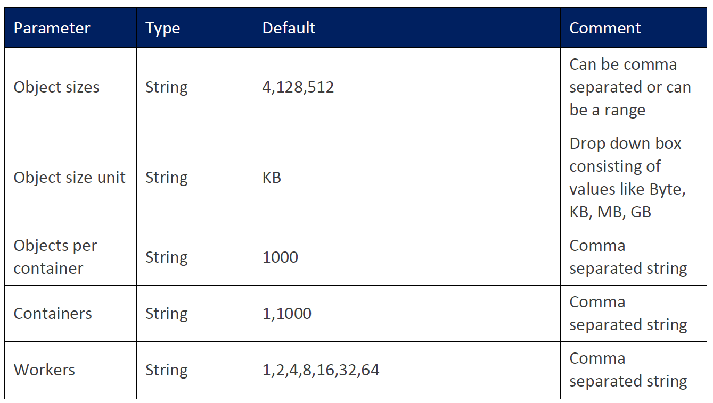
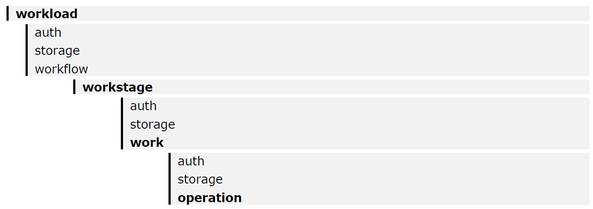
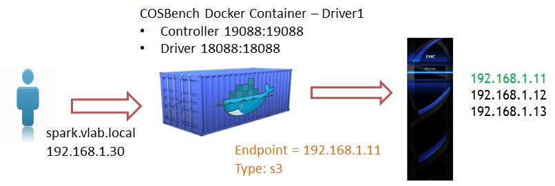
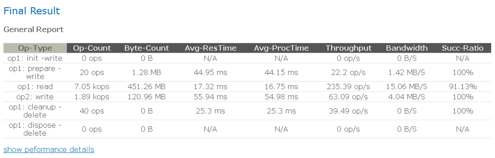
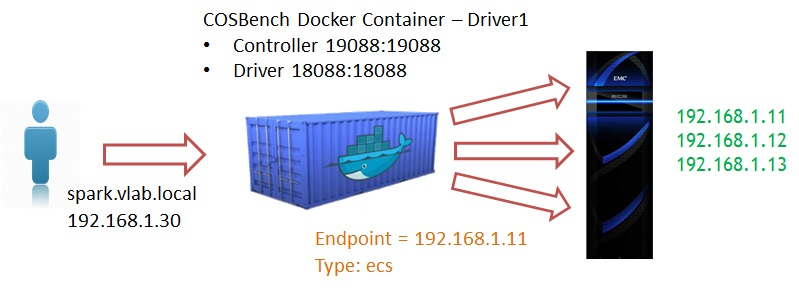
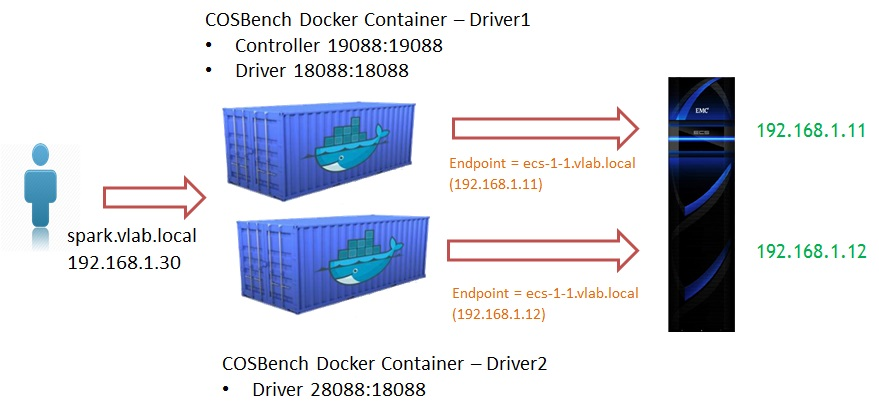

# COSBench vLab - Running performance tests in ECS#
---
DellEMC Elastic Cloud Storage (ECS) is a software-defined, cloud-scale, object storage platform that combines the cost advantages of commodity infrastructure with comprehensive protocol support for unstructured (Object and File) workloads.

COSBench is a benchmarking tool to measure the performance of Cloud Object Storage solutions.

The goal of this Lab is to show how to use COSBench to perform benchmarks with ECS using the S3 API. This lab will focus on the COSBench setup with the *ecs* or the *s3* plugins to send requests to all the ECS nodes. And these are the corresponding parts of the lab:

- 1 - ECS configuration
- 2 - Cosbench basic configuration
- 3 - ECS Plugin
- 4 - Parallelizing workloads using several COSBench Drives
- 5 - Mixed Workloads
- 6 - SSL (optional)


## Prerequisites

### Software
The best practice is to use one COSBench Driver for each ECS node.

In this case, we'll use a COSBench Docker container, already loaded in your Spark VM.
```
spark.vlab.local: 192.168.1.30
```

In general, the latest version of the COSBench project can be downloaded from:
```
https://github.com/intel-cloud/cosbench/releases`
```


###Network
In general, COSBench  should  run on an infrastructure that has a 10 Gb connectivity to the ECS rack. Additionally, if you want to get a throughput higher than 2 GB/s, you need to make sure ECS is connected to the network with 4 or more uplinks.

In this case, the COSBench Docker containers will run on the same virtual infrastructure where the ECS runs. Since the lab environment will be purely virtual, these tests won't provide optimal performance results, but will show you how these tests should be run in a real environment.

Also, don't expect to get more than 300-400 MB/s from a VM running on vSphere.

### Load Balancers 
A load balancer will generally quickly become the bottleneck, so we don’t recommend using one.


### ECS
If you don't have access to an ECS system, you can create an account on [ECS Test Drive](http://portal.ecstestdrive.com).

For this lab, please use the ECS F&F deployed in your lab:
- ecs-1-1.vlab.local: 192.168.1.11
- ecs-1-2.vlab.local: 192.168.1.12
- ecs-1-3.vlab.local: 192.168.1.13

# Lab

## 1 - ECS Configuration

Create an ECS object user called *cosbench* and get its secret key. 

COSBench will create and delete the buckets automatically.

**Note:** If you want to perform benchmarks with D@RE, File System or Access During Outage (ADO) enabled, you need to enable them at the namespace level. The buckets created by COSBench will then inherit these properties.


## 2 - COSBench configuration

COSbench consists of two key components:

- **Driver** (also referred to as COSBench Driver or Load Generator):
	- Responsible for workload generation, issuing operations to target cloud object storage, and collecting performance statistics.
	- Can be accessed via *http://<driver-host>:18088/driver/index.html*.
	
- **Controller** (also referred to as COSBench Controller):
	- Responsible for coordinating drivers to collectively execute a workload, collecting and aggregating runtime status or benchmark results from driver instances, and accepting workload submissions.
	- Can be accessed via *http://<controller-host>:19088/controller/index.html.*

The controller and driver can be deployed on the same node or different nodes, and the node can be a physical or virtual machine (VM) instance.

###2.1 - COSBench controller & drivers

For this lab, the COSBench Docker container is already placed in the Spark VM. 

**Note:** In general, you can pull the COSBench Docker container image using the command below:
`docker pull djannot/cosbench`

Start the container that resided in your VM, by executing:

```
docker images # Verify that you have a Docker Container Image djannot/cosbench:0.4.2.c4
docker run -it --rm -p 19088:19088 -p 18088:18088 --name=driver1 djannot/cosbench:0.4.2.c4 bash # Run the container, mapping the Controller and Driver ports
./start-all.sh # Start COSBench services
control + p + q  # Exit the container if needed.
docker ps # Verify that the Docker Container is running
```

**Note**: you need to use the following command to enter back in this Docker container
```
docker exec -it driver1 bash
``` 

If you start a second Docker Container / COSBench VM; the first VM will act as a COSBench controller and driver. All the other VMs will only act as COSBench drivers.  For the moment, we'll use a single docker container with both controller and driver. 

Launch the COSBench GUI by running http://192.168.1.30:19088/controller/index.html in a browser. Familiarize with the COSBench GUI.



##2.2.  Workloads - Running the first COSBench Job

COSBench software comes with a few XML examples, located in */cosbench/conf/* folder, that could be useful to understand the tool:
- *workload-config.xml* is a template with comments to describe how to configure for different storage types. It will access mock storage to help with verification.
- *swift-config-sample.xml* is a template for the OpenStack Swift storage system.
- *s3-config-sample.xml* is a template for Amazon S3 compatible storage system.

Basic workload configuration options are also available from the workload configuration page on the controller web console. However, we'll use customized XML files for maximum flexibility. 

Following input parameters are necessary for defining each workload:



Apart from these parameters, you can also add as many read-write-delete combinations as you want to any workload. We'll go through this in the following sections. Let's keep it simple for now.

A workload is represented as an XML file with the following structure:



- Workload -> work stage -> work -> operation
- If necessary, one workload can define one or more work stages.
- Execution of multiple work stages is sequential, while execution of work in the same work stage is parallel.
- For each piece of work, “workers” is used to tune the load.

**Workload example: s3-config-sample.xml**

```
<?xml version="1.0" encoding="UTF-8" ?>
<workload name="s3-sample" description="sample benchmark for s3">

  <storage type="s3" config="accesskey=cosbench;secretkey=PAVCYmIgSyuLgFIXX+3r9gHS4STb/ebFn9CPbhrO;proxyhost=;proxyport=;endpoint=http://192.168.1.11:9020" />

  <workflow>

    <workstage name="init">
      <work type="init" workers="1" config="cprefix=s3testqwer;containers=r(1,2)" />
    </workstage>

    <workstage name="prepare">
      <work type="prepare" workers="1" config="cprefix=s3testqwer;containers=r(1,2);objects=r(1,10);sizes=c(64)KB" />
    </workstage>

    <workstage name="main">
      <work name="main" workers="8" runtime="30">
        <operation type="read" ratio="80" config="cprefix=s3testqwer;containers=u(1,2);objects=u(1,10)" />
        <operation type="write" ratio="20" config="cprefix=s3testqwer;containers=u(1,2);objects=u(11,20);sizes=c(64)KB" />
      </work>
    </workstage>

    <workstage name="cleanup">
      <work type="cleanup" workers="1" config="cprefix=s3testqwer;containers=r(1,2);objects=r(1,20)" />
    </workstage>

    <workstage name="dispose">
      <work type="dispose" workers="1" config="cprefix=s3testqwer;containers=r(1,2)" />
    </workstage>

  </workflow>
</workload>
```

In this example, COSBench uses one ECS node as Endpoint; and it split the job in several tasks:
- **init**: We create two buckets; s3testqwer1 and s3testqwer2 (s3testqwer is the prefix), with the parameters inherited from the namespace to which the object user COSBench belongs to.
- **prepare**: It prepares the READ operation by creating 10 objects, 64KB each.
- **main**: We'll simulate a workload 80% READS, 20% WRITES, reading objects 1-10, writting objects 11-20.
- **cleanup**: We delete objects 1-20.
- **dispose**: It deletes the buckets



Submit this workload, modifying the Accesskey (ECS object user), Secretkey (ECS secret key) and endpoint (ECS node).

**Hint:** Appart from the COSBench GUI, that provide statistics, you can use S3 Browser to check how buckets/objects are created/deleted by the COSBench user.

**Task 1:** Create a new workload with these parameters:

- 1 bucket called cosbenchbucket1
- 1 KB Object size
- 100 objects
- 70% READS, 30% WRITES

##2.3. - Analyzing results - Metrics

All results are stored in the *archive* directory and shown in the COSBench interface.

Please take a look at the numbers you get from the tests.



**Throughput (Operations/s or Op/s)**

- The operations completed in one second
- The reported throughput is calculated by dividing total successful requests by total run time

**Response Time (in ms)**

- The duration between operation initiation and completion
- The reported Response Time is the average of response time for each successful request
- One additional processing time is already reported to help breakdown response time.

**Bandwidth (MB/s)**

- The total data in MB transferred per second
- The reported bandwidth is calculated by dividing total bytes transferred by total run time
- 1 MB = 1000*1000 bytes

**Success Ratio (%)**

- The ratio of successful operations
- The reported success ratio is calculated by dividing the number of successful requests by the total number of requests

**Other Metrics**

- Op-count: total number of operations
- Byte-count: total data transferred

#3- ECS Plugin

ECS Plugin for COSBench has been developed using the *ecs-s3* API extension. It will take one of the ECS nodes as an input and will balance the load among all the ECS nodes in the VDC.

ECS Plugin is already configured in your lab. Please, refer to *Appendix 1 - Configuring ECS Plugin in COSBench* for more information about how to download and configure it.

In order to use the ECS plugin instead of standard *s3* one, you need to specify *ecs* as *storage type* in the COSBench job configuration file. The ECS plugin will automatically balance the load across all the ECS nodes without the need of a Load Balancer.

```
<storage type="ecs" config="accesskey=xxx;secretkey=yyy;endpoint=http://x.x.x.x:9020"/>
```



**Task 2:** Repeat Task 1 using the ECS plugin and compare results.

#4 - Parallelizing workloads using several COSBench Drivers

When using the standard *s3 plugin*, the load is not balanced across the ECS nodes.
The workaround is to specify a hostname and to edit the hosts file of each COSBench Driver to resolve this hostname with a different ECS node IP.
For example:
- Driver 1 will locally resolve *hostname* with the IP of ECS node 1.
- Driver 2 will locally resolve *hostname* with the IP of ECS node 2.
- ...
This way, each COSBench Drive will be mapped to a ECS node.

We usually use the *ECS Node 1 hostname* for this purpose so that we can simplify the SSL configuration if SSL is used. But any *hostname* will work as long as you configure the same in all the drives.

In this lab, we recommend using:

```
- Hostname: ecs-1-1.vlab.local 
- Mapped to 192.168.1.11 in hosts file, Driver1
- Mapped to 192.168.1.12 in hosts file, Driver2
```

The recommendation is to configure as many Drivers as ECS nodes you want to use, so that the COSBench job is directly distributed across all the nodes without a Load Balancer need.


**Task 3:** Create a second COSBench Drive and parallelize workloads



Please, refer to *Apendix 2: Adding more COSBench drivers* for the Drive addition.

**Task 4:** Run a COSBench job with the new configuration

Use the following line in the XML job config file:

```
<storage type="s3" config="path_style_access=true;accesskey=cosbench;secretkey=PAVCYmIgSyuLgFIXX+3r9gHS4STb/ebFn9CPbhrO;proxyhost=;proxyport=;endpoint=http://ecs-1-1.vlab.local:9020"/>

````
Please, note that we introduce a new option *path_style_access=true* to define the addressing style and avoid DNS resolution errors, since we now use a *hostname* as the endpoint.

**Note:** When using SSL, use https and one of the hostname of the ecs node (and use the hosts file to use different nodes).

#5 - Mixed Workloads

COSBench can accept multiple workload submissions, it maintains one job queue for those workloads, and executes them one by one.

However, in each workload, we can mix different load types / operations and execute them in parallel or sequentially. This is very useful to simulate customer load patterns.

In the following XML example, we mix 10KB and 100KB objects, parallelizing READS and WRITES for 10KB and 100KB objects, respectively, running them in a sequential way. Please take a look at the XML config file.

There are multiple options that can be added/modified to make this simulation more accurate according to the customer requirements. Please, refer to the COSBench documentation for more information about it.

Finally, we can also specify which operations/loads we run in each Driver (that is specifically mapped to an ECS node). We can also add this level of granularity to polish the workload in order to get a better performance.

```
<?xml version="1.0" encoding="UTF-8" ?>
<workload name="ECS MAX Tests" description="ECS MAX Test">
<storage type="s3" config="path_style_access=true;accesskey=cosbench;secretkey=PAVCYmIgSyuLgFIXX+3r9gHS4STb/ebFn9CPbhrO;proxyhost=;proxyport=;endpoint=http://ecs-1-1.vlab.local:9020"/>

<workflow>
      <workstage name="init">
         <work type="init" workers="1" config="cprefix=test-10k-;containers=r(1,1);driver=driver1" />
         <work type="init" workers="1" config="cprefix=test-100k-;containers=r(1,1);driver=driver2" />
      </workstage>
      <workstage name="prepare">
         <work type="prepare" workers="10" config="cprefix=test-10k-;containers=r(1,1);objects=r(1,100);sizes=c(10)KB;driver=driver1"/>
         <work type="prepare" workers="10" config="cprefix=test-100k-;containers=r(1,1);objects=r(1,100);sizes=c(100)KB;driver=driver2"/>
      </workstage>
      <workstage name="10Kworkload">
         <work name="vdc1" workers="20" totalOps="200" >
            <operation type="write" ratio="20"  config="cprefix=test-10k-;containers=s(1,1);objects=s(101,200);sizes=c(10)KB;driver=driver1"/>
            <operation type="read" ratio="80" config="cprefix=test-10k-;containers=s(1,1);objects=s(1,100);driver=driver1"/>
         </work>
      </workstage>
      <workstage name="100kworkload">
        <work name="vdc1" workers="20" totalOps="200">
           <operation type="write" ratio="20"  config="cprefix=test-100k-;containers=s(1,1);objects=s(101,200);sizes=c(100)KB;driver=driver2"/>
           <operation type="read" ratio="80" config="cprefix=test-100k-;containers=s(1,1);objects=s(1,100);driver=driver2"/>
          </work>
      </workstage>     
       <workstage name="cleanup">
         <work type="cleanup" workers="20" config="cprefix=test-10k-;containers=r(1,1);objects=r(1,200);driver=driver1" />
         <work type="cleanup" workers="20" config="cprefix=test-100k-;containers=r(1,1);objects=r(1,200);driver=driver2" />
       </workstage>
      <workstage name="dispose">
          <work type="dispose" workers="1" config="cprefix=test-10k-;containers=r(1,1);driver=driver1" />
          <work type="dispose" workers="1" config="cprefix=test-100k-;containers=r(1,1);driver=driver2" />
       </workstage>
   </workflow>
</workload>

```

#6 - SSL (optional)

To be able to perform tests using HTTPS, you need to generate a self-signed certificate on ECS and then to import it in the JVM trust store on each COSBench driver.

For more information about how to configure it, please refer to the ECS & COSBench Test Plan locates in the ECS FastPass / Proof of Concept Test Plans Website.
[https://inside.dell.com/docs/DOC-218468](https://inside.dell.com/docs/DOC-218468)

# Appendix 1 - Configuring ECS Plugin in COSBench:

Obtain the ECS plugin for the COSBench release you want to use and copy it under the */cosbench/osgi/plugins/* directory on each COSBench driver.

Edit the *conf/.driver/config.ini* file as below (by adding the line in bold):
```
plugins/cosbench-castor,\
**plugins/cosbench-ecs@7\:start,\**
plugins/cosbench-log4j,\
````
Edit the *start-driver.sh* file as below (by adding the content in bold):
````
OSGI_BUNDLES="cosbench-log_${VERSION} cosbench-tomcat_${VERSION} cosbench-config_${VERSION} cosbench-http_${VERSION} cosbench-cdmi-util_${VERSION} cosbench-core_${VERSION} cosbench-core-web_${VERSION} cosbench-api_${VERSION} cosbench-mock_${VERSION} cosbench-ampli_${VERSION} cosbench-swift_${VERSION} cosbench-keystone_${VERSION} cosbench-httpauth_${VERSION} cosbench-s3_${VERSION} cosbench-librados_${VERSION} cosbench-scality_${VERSION} cosbench-cdmi-swift_${VERSION} cosbench-cdmi-base_${VERSION} cosbench-driver_${VERSION} cosbench-driver-web_${VERSION} **cosbench-ecs_${VERSION}**"
````
Restart the driver by executing `stop-driver.sh` and then `start-driver.sh`.

# Apendix 2: Adding more COSBench Drivers

In a Docker environment, add a second driver by running a second COSBench Docker Container (mapped to a different port) and modifying the configuration as described below.

In a Linux environment, add a second driver by adding a new Linux COSBench container and modifying the configuration file with the IP of the second drive.

Start a second docker container, mapped to port 28088 (free port in 192.168.1.30 VM).

```
docker run -it --rm -p 28088:18088 --name=driver2 djannot/cosbench:0.4.2.c4 bash

````

On the COSBench controller, edit the *conf/controller.conf* file as below, in order to add all the drives to the configuration.

```
[controller]
drivers = 2
log_level = INFO
log_file = log/system.log
archive_dir = archive

[driver1]
name = driver1
url = http://192.168.1.30:18088/driver

[driver2]
name = driver2
url = http://192.168.1.30:28088/driver

```

Add as many drivers as you need to.

Then, execute the `start-all.sh` script on the controller and the `start-driver.sh` on the drivers.

Check using the COSBench GUI that both drivers are alive.

**Note:** If you have problems starting new drivers, check the firewall and disable it if needed.
`systemctl stop firewalld`
`systemctl disable firewalld`

# Apendix 3: Fixing a COSBench Bug

There is a bug in the current COSBench release that can provoke errors when running standard s3 COSBench jobs.

In order to fix it, you need to:

- Stop all COSBench processes (controller, drivers)
- Edit `cosbench-start.sh`, locate the *java* launching line, and add 
    "-Dcom.amazonaws.services.s3.disableGetObjectMD5Validation=true"
```
/usr/bin/nohup java -Dcom.amazonaws.services.s3.disableGetObjectMD5Validation=true -Dcosbench.tomcat.config=$TOMCAT_CONFIG -server -cp main/* org.eclipse.equinox.launcher.Main -configuration $OSGI_CONFIG -console $OSGI_CONSOLE_PORT 1> $BOOT_LOG 2>&1 &
```
- Restart COSBench processes

#References

- GitHub - COSBench -  https://github.com/intel-cloud/cosbench
- Github - COSBench releases" (https://github.com/intel-cloud/cosbench/releases)
- COSBench Wiki: (https://github.com/intel-cloud/cosbench/wiki)
- COSBench-Workload-Generator: (https://github.com/giteshnandre/COSBench-Workload-Generator)
- COSBench Examples_ [https://github.com/intel-cloud/cosbench/tree/master/release/conf](https://github.com/intel-cloud/cosbench/tree/master/release/conf)
-  DELLEMC ECS FastPass / Proof of Concept Test Plans Website.
[https://inside.dell.com/docs/DOC-218468](https://inside.dell.com/docs/DOC-218468)
