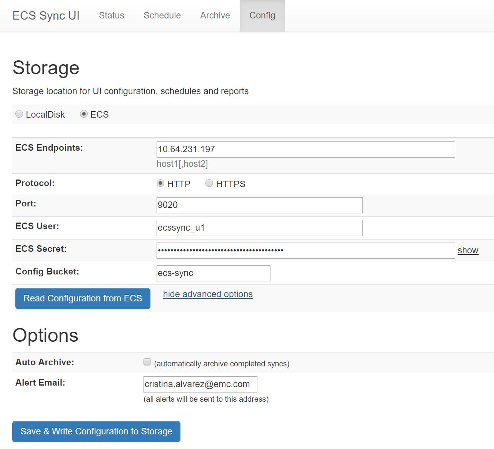
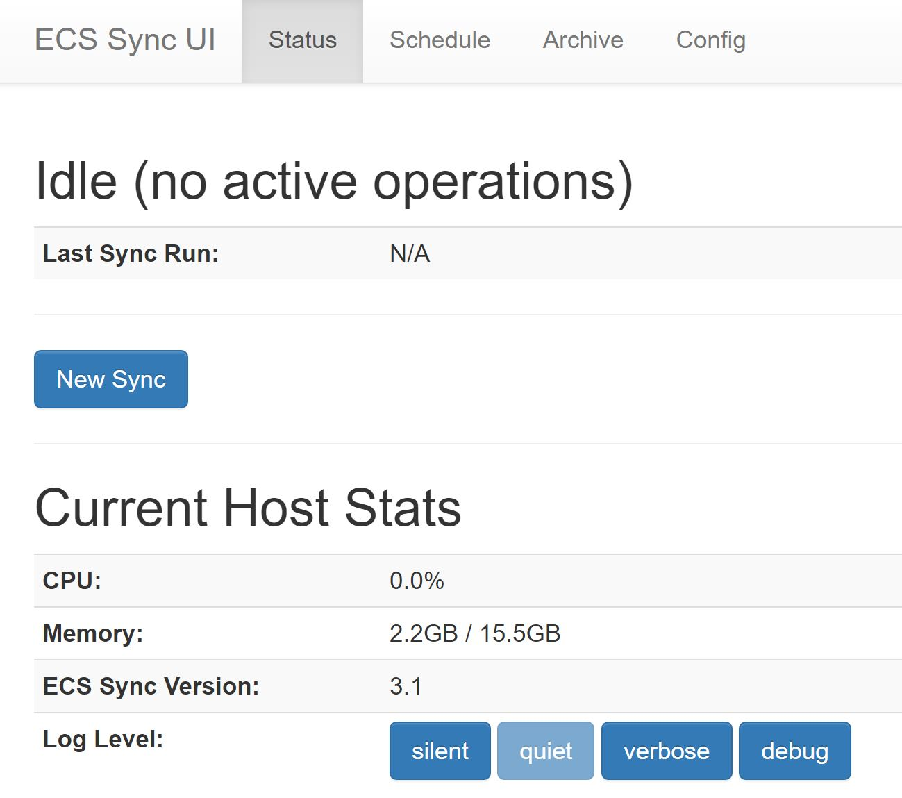
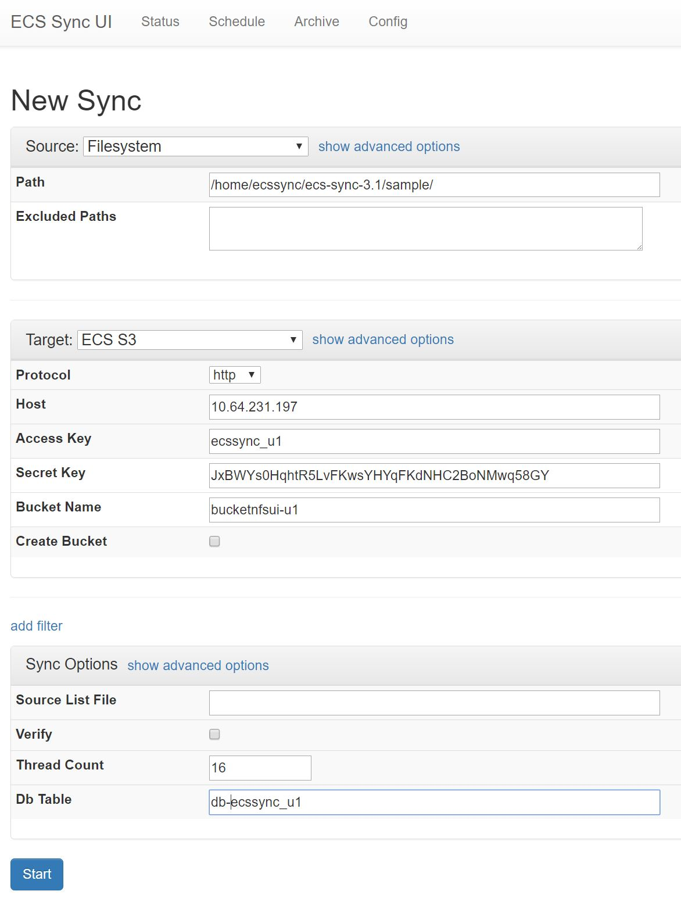
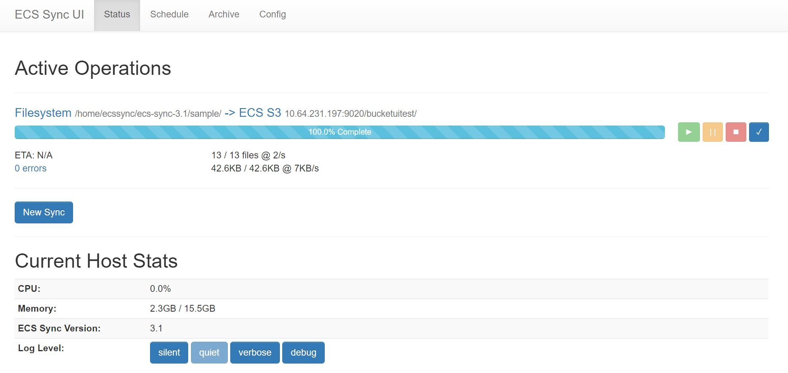
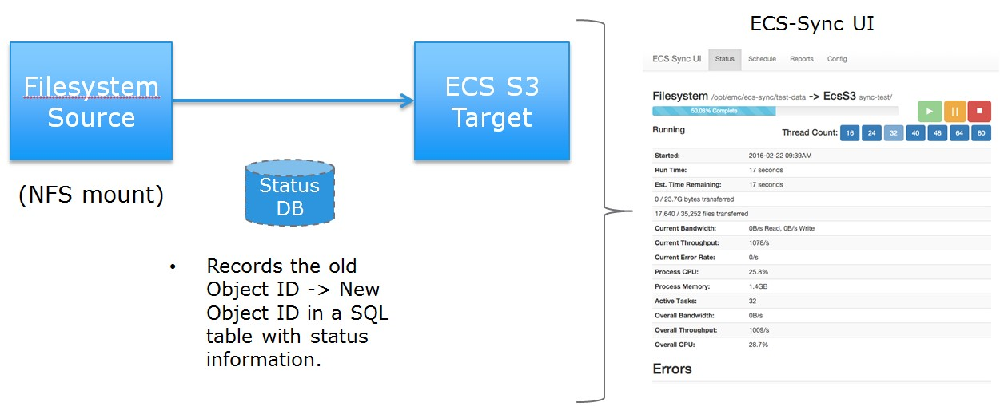

# ECS-Sync vLab - Migrating data to ECS#
---
DellEMC Elastic Cloud Storage (ECS) is a software-defined, cloud-scale, object storage platform that combines the cost advantages of commodity infrastructure with comprehensive protocol support for unstructured (Object and File) workloads.

ECS-Sync is an open source software tool, developed by DELLEMC engineering, designed to move large amounts of data across the network while maintaining app association and metadata.

It can be used for many use cases:

- Migrating data from a file system to ECS using the S3 API
- Migrating data from Amazon to ECS, pull blobs out of a database and move them into an S3 bucket
- Moving clips from Centera to ECS
- Zip up an Atmos namespace folder into a local archive
- ...

This lab we will be focused on two of the most common use cases that could be valuable in PoCs: File System to ECS and S3 (ECS in our case) to ECS S3 with the corresponding ECS/ECS-Sync configuration files and common troubleshooting actions. 

- 1 - ECS configuration
- 2 - ECS-Sync basic configuration
- 3 - S3 to ECS
- 4 - NFS to ECS

## Prerequisites

### Software

The latest ECS-Sync release is available in the Gihub repository:
https://github.com/EMCECS/ecs-sync/releases

>**Note:** There is also an OVA file that contains a Linux image and the required tools to run ECS-Sync. This VM also includes other tools used for migrating data. Please, refer to *Appendix 1 - Deploying a ECS-Sync OVA* for more information about the OVA deployment. It is the recommended option when using ECS-Sync in a customer site.

In this Lab, we'll use this OVA running the latest ECS-Sync 3.1, for both the ECS-Sync CLI and the ECS-Sync UI.

**Task 1: Accessing the ECS-Sync CLI**

- SSH into your designated ECS-Sync OVA.
>**ECS-Sync OVA details:** 
> IP: 10.246.23.122 - 10.246.23.132
> User/Password: root / Ecs$ync0va

- Go to the ECS-Sync home directory: `/home/ecssync/ecs-sync-3.1`

### Network

ECS-Sync uses the network to copy data from the source to the target. So, the ECS-Sync VM should have excellent connectivity to both the source and the target of the copy, preferably 10 Gigabit Ethernet.

### Load Balancers 

In most of cases, no load balancer is required when using ECS-Sync. From ECS-Sync 2.0, it uses the new ECS S3 plugin with the smart-client feature. This plugin provides client-side load-balancing, node discovery, VDC awareness and health checking. 

From ECS-Sync 3.x, it is also possible to enable *geo-pinning* in S3. This feature uses a standard algorithm to select a consistent VDC for each object key or bucket name. It is specially useful for environments with 3+ VDCs.

In the case of CAS being the source or the target of the copy, no load balancer is required since the CAS SDK already includes internal load balancing itself.

### ECS

As the usual target of ECS-Sync copy jobs, we need to create a bucket (with the desired features) in ECS. Note that the bucket can be created from ECSSync, but it is a best practice to do it from the ECS, having full control of the features enabled in that bucket.

ECS-Sync will need this information:

- Endpoints (ECS nodes)
        - One node is enough if using the ECS S3 plugin with the smart-client
- Bucket
	- FS enabled if using NFS/HDFS
- Credentials
	- User /Secret Key for S3
	- pea file for CAS
	- Subtenant ID for Atmos

If you don't have access to an ECS system, you can create an account on [ECS Test Drive](http://portal.ecstestdrive.com).

For this lab, please use the following ECS:++++++++++++++++++++

> IP: 10.247.7.161
> User / Password: root / boston401

# Lab

## 1 - ECS Configuration

**Task 2: Preparing the ECS environment**

- Create an ECS object user called *ecssync_u1* and get its secret key. 
- Create an ECS object user called *ecssync_u2* and get its secret key. 
- Create a bucket with FS enabled called *bucketnfs-u1*, owned by *ecssync_u1*
- Create a bucket with FS enabled called *bucketnfsui-u1*, owned by *ecssync_u1*
- Create a bucket with FS disabled called *buckets3-u2*, owned by *ecssync_u2*
- Create a bucket with FS enabled called *bucketnfs2-u1*, owned by *ecssync_u1*


## 2 - ECS-Sync Configuration

The ECS-Sync configuration will vary depending on the nature of the data to copy.

There are several ECS-Sync execution paths:

- UI
	- ECS-Sync 3.1 provides a browser-based UI for simple filesystem-to-ECS archiving operations
- Command line
	- All plugins are self-documenting and self-configuring so they can be executed from the command line
- Spring Integration
	- An entire plugin chain can be configured using the supplied Spring bootstrapper or loaded into an existing Spring application
- Custom Development
-	 Plugins can be configured and executed at runtime from any Java application (a *toolbox* for reuse in other applications)

We'll use mainly ECS-Sync CLI and ECS-Sync UI in this lab.


## 3 - ECS-Sync copy tasks

This section will cover the most popular ECS-Sync copies.

- File System to ECS S3
- S3 to ECS S3

### 3.1 - File System to ECS S3

Directories and files are processed as they are listed. So, first will be the root folder and all its children, then the children of all the 1st-level directories and so on.

Directories are preserved in S3 as empty objects.  All directories and files will preserve their *mtime/atime/crtime* and *POSIX owner/group/mode*. These features can be viewed as user-metadata on the objects starting with *x-emc-(mtime|atime|crtime) and x-emc-posix-(owner-name|group-owner-name|mode)*.  When syncing back to the filesystem, ECS-Sync will attempt to restore these attributes (so, you need to run as *root* and mount as a *root-host*).

Subdirectories can be excluded from the copy using the *--exclude-paths <pattern,pattern,...>* option. This uses proper regular expressions, so you would have to specify something like *\.snapshot* in order to exclude the snapshot subdirectory from the copy.

When copying from NFS, it is also useful to run *iozone* on the mount in order to find the optimal thread count.

#### 3.1.1 - Using XML file

ES-Sync is designed to be run from a submitted xml file that contains all necessary options, addresses, and credentials. This file can be created by hand (there are examples in *ecssync/ecs-sync-[version]/sample)* or easily via the newly included XML Generator. A guide to the XML Generator can be found [here](https://github.com/EMCECS/ecs-sync/wiki/XML-Generator-(3.0.1)). Once a proper xml configuration file has been created and modified with the correct information, you're ready to begin your sync.

In this section, we'll use the *directory-to-ecs-s3.xml* file as a template for the FS to ECS S3 copy.

`cat sample/directory-to-ecs-s3.xml `

**Task 3: FS to ECS S3 copy using a XML file**

Source | Target
--- | ---
Filesystem on the ECS-Sync VM | ECS S3 Bucket
/home/ecssync/ecs-sync-3.1/sample/ | bucketnfs-u1

- Using the *directory-to-ecs-s3.xml* template as a reference, we'll create a FS to ECS S3 copy job

- Create a new *directory-to-ecs-s3-test.xml* file in the sample directory with the following configuration (simplified template):

`vi sample/directory-to-ecs-s3-test.xml `

```
<?xml version="1.0" encoding="UTF-8" standalone="no"?>
<syncConfig xmlns="http://www.emc.com/ecs/sync/model" xmlns:xsi="http://www.w3.org/2001/XMLSchema-instance" xsi:schemaLocation="http://www.emc.com/ecs/sync/model model.xsd">
    <syncOptions>
        <threadCount>32</threadCount>
        <verify>true</verify>
        <logLevel>verbose</logLevel>
    </syncOptions>

    <source>
        <filesystemConfig>
            <path>/home/ecssync/ecs-sync-3.1/sample/</path>
        </filesystemConfig>
    </source>

    <target>
        <awsS3Config>
            <host>10.64.231.197</host><!-- defaults to HTTPS // Added Port and Protocol to force HTTP instead-->
            <port>9020</port>
            <protocol>http</protocol>
            <accessKey>ecssync_u1</accessKey>
            <secretKey>fr9GdlC4sBvC1H9ImRWIgkdyl7mODZbKL2gakcf6</secretKey>
            <disableVHosts>true</disableVHosts>
            <legacySignatures>true</legacySignatures>
            <bucketName>bucketnfs-u1</bucketName>
            <createBucket>false</createBucket>
            <!-- default behavior is to preserve directories (including empty ones) for later restoration -->
            <preserveDirectories>false</preserveDirectories>
        </awsS3Config>
    </target>
</syncConfig>


```

> This ECS-Sync job copies data from the File System */home/ecssync/ecs-sync-3.1/sample/* to the S3 ECS bucket *bucketnfs-u1*.

- Execute the ECS-Sync copy:
`ecs-sync-ctl --submit sample/directory-to-ecs-s3-test.xml`

- This is the expected output you should get:

```
EcsSync v3.1
2017-01-20 08:50:50 WARN  [main           ] RestServer: REST server listening at http://localhost:9200/
Transferred 34,050 bytes in 1 seconds (34,050 bytes/s)
Successful files: 12 (12/s) Failed Files: 0
Failed files: []
```

- Verify with S3 Browser that *bucketnfs-u1* has been populated with the  content of */home/ecssync/ecs-sync-3.1/sample/* directory.


#### 3.1.2 - ECS-Sync UI

ECS-Sync also includes a browser–based User Interface (UI) for ease of use from version 2.1. 

The ECS-Sync UI provides:

- Filesystem, ECS S3, S3, Atmos, CAS,...
- Supports multiple simultaneous syncs with progress and error reporting
- Archives sync completion and error reports
- Options for multiple sync schedules
- Email notifications (start, complete, error)
- Configuration stored in ECS - VM is disposable

**Task 4: Lauching the ECS-Sync UI**

- Make sure *ecs-sync* and *ecs-sync-ui* services are started in your ECS-Sync OVA
> `sudo service ecs-sync-ui status / start`

- Open a Web Browser and go to ([https://10.246.23.1xx](https://10.246.23.1xx)). The ECS-Sync UI will launch within a few minutes.
	- Default user/password: admin / ecs-sync
	
- Once your ECS-Sync UI instance is launched, configure the ECS-Sync UI repository for internal use:
    -  Go to *Config* Tab, indicate the *ECS endpoint = ECS_node_IP*, *ECS User = ecssync_u1* and *Secret Key = ecssync_u1_secret_key*, and an email for alerts. Click *Save & Write Configuration to ECS*.

    -  In the current ECS-Sync UI version a bucket called *ecs-sync* will be created to store the ECS-Sync UI configuration. This bucket cannot be used as a target for an ECS-Sync copy.



**Task 5: Creating a FS to ECS S3 copy using the ECS-Sync UI**

Source | Target
--- | ---
Filesystem on the ECS-Sync VM | ECS S3 Bucket
/home/ecssync/ecs-sync-3.1/sample/ | bucketnfsui-u1

- In order to create a Sync job, go to *Status* Tab and click "New Sync* 



    - Select *Filesystem* in the *Source* options
   	 -  Indicate the path of the local FileSystem to copy
    - Select *ECS S3* in *Target* options. 
   	 -  Indicate the credential of your S3 target.
       	 -  **Note** It is recommended to manually create buckets in the ECS GUI, so that you can control the bucket parameters (FS enabled,....). 


 
- Clicking in *show advanced options*, you can choose among other copy options. Please refer to the ECS-Sync UI documentation for more details about each one. 

>**Note:** There is a bug in the ECS-Sync 3.1 UI with blank spaces.  Please display all options and put a space in any blank text field before starting the job.



- The *Schedule* tab shows all the Scheduled ECS-Sync copies in the ECS-Sync VM.

 

- There is also a *Reports* tab that shows all the copy reports.

#### 3.1.3 - Isilon Backup

ECS-Sync can be used as a tool for backup. It is easy to copy a NAS share to ECS to provide a low cost archiving data protection on a different media using the ECS-Sync UI.

Isilon data (NFS) can be periodically copied to ECS (S3) by running regular incremental ECS-Sync copies.

 

### 3.2 - S3 to ECS S3

This section will show how to perform a copy from a S3 bucket to an ECS S3 bucket. 

In this case, since we cannot use Amazon as a source, we'll copy from a S3 ECS bucket to another S3 ECS bucket. 


**Task 6: S3 to ECS S3 copy using a XML file**

Source | Target 
--- | ---
ECS S3 Bucket | ECS S3 Bucket 
bucketnfs-u1 | buckets3-u2 

- In Task 3, we populated*bucketnfs-u1* with a bunch of files. We'll use this bucket as the source of our S3 copy. Verify with S3 Browser the content of this bucket. 

- Using the *aws-ecs-bucket-migration.xml* template as a reference, we'll create a S3 to ECS S3 copy job
 
- Create a new *aws-ecs-bucket-migration-test.xml* file in the sample directory with the following configuration (simplified template):

`vi sample/aws-ecs-bucket-migration-test.xml `

```
<?xml version="1.0" encoding="UTF-8" standalone="no"?>
<!--This is a sample configuration to migrate an AWS S3 bucket to an ECS S3 bucket, including all object versions. It uses 32 threads, verifies data using MD5 checksums and tracks status of all objects in a database table.-->
<syncConfig xmlns="http://www.emc.com/ecs/sync/model"
            xmlns:xsi="http://www.w3.org/2001/XMLSchema-instance"
            xsi:schemaLocation="http://www.emc.com/ecs/sync/model model.xsd">
    <options>
        <threadCount>32</threadCount>
        <verify>true</verify>
    </options>

    <source>
        <ecsS3Config>
            <protocol>http</protocol>
            <host>10.64.231.197</host>
            <accessKey>ecssync_u1</accessKey>
            <secretKey>fr9GdlC4sBvC1H9ImRWIgkdyl7mODZbKL2gakcf6</secretKey>
            <bucketName>bucketnfs-u1</bucketName>
            <createBucket>false</createBucket>
            <includeVersions>false</includeVersions>
        </ecsS3Config>
    </source>

    <target>
        <ecsS3Config>
            <protocol>http</protocol>
            <host>10.64.231.197</host>
            <accessKey>ecssync_u2</accessKey>
            <secretKey>b67yP4sJgq/1Q+8OHku/fil3JTb1twHCeX30FXO9</secretKey>
            <bucketName>buckets3-u2</bucketName>
            <createBucket>true</createBucket>
            <includeVersions>false</includeVersions>
        </ecsS3Config>
    </target>
</syncConfig>


```

> This ECS-Sync job copies data from S3 ECS Bucket *bucketnfs-u1*, owned by *ecssync_u1* to *buckets3-u2*, owned by *ecssync_u2*

- Execute the ECS-Sync copy:

`ecs-sync-ctl --submit sample/aws-ecs-bucket-migration-test.xml`

- Verify with S3 Browser the content of the **buckets3-u2* bucket
- 

### 3.3 - Managing the ECS-Sync copy 

#### 3.3.1 - Modifying the ECS-Sync copy using *ecs-sync-ctl-xx.jar*

As part of the ECS-Sync suite, there is a REST service that allows interaction over HTTP to *start*, *pause*, *resume* and *stop* sync jobs as well as change thread counts and provide progress information.

This *ecs-sync-ctl-xx.jar* file (previously called *ecs-sync-cli-xx.jar*) can be downloaded from the [GitHub website](https://github.com/EMCECS/ecs-sync/releases). It should already be available in your ecs-sync home directory.

These are *ecs-sync-ctl* options to manage, modify or monitor an ECS-Sync copy:

```
usage: java -jar ecs-sync-ctl-{version}.jar [--debug] --delete <job-id> | --list-jobs | --pause <job-id> | --resume <job-id> | --set-threads <job-id> | --status <job-id> | --stop <job-id> | --submit <xml-file> | --xml-gen <output-file> [--endpoint <url>] [--host-info]  [--log-file <filename>] [--log-level <level>] [--log-pattern <log4j-pattern>]   [--set-log-level]     [--threads <thread-count>] [--verbose] [--xml-comments] [--xml-filters <filter-list>]  [--xml-simple] [--xml-source <source-prefix>] [--xml-target <target-prefix>]

```

| Option | Description |
| ------------- | ------------- | 
| --delete <job-id> | Deletes a sync job from the server. The job must be stopped first. | 
| --endpoint <url> | Sets the server endpoint to connect to.  Default is http://localhost:9200 |
| --list-jobs | Lists jobs in the server |
| --log-file <filename> | Filename to write log messages. Setting to STDOUT or STDERR will write log messages to the  appropriate  process stream.  Default is STDERR. |
| --log-level <level> | Sets the log level: DEBUG, INFO, WARN, ERROR, or FATAL.  Default is ERROR. |
| --log-pattern <log4j-pattern> | Sets the Log4J pattern to use when writing log messages.  Defaults to  %d{yyyy-MM-dd HH:mm:ss}%-5p[%t] %c{1}:%L - %m%n |
| --pause <job-id> | Pauses the specified sync job |
| --query-threads <thread-count> | Used in conjunction with --set-threads to set the number of query threads to use for a job. |
| --resume <job-id> | Resumes a specified sync job |
| --set-threads <job-id> | Sets the number of sync threads on the server.  Requires --query-threads and/or --sync-threads arguments |
| --status <job-id> | Queries the server for job status |
| --stop <job-id> | Terminates a specified sync job |
| --submit <xml-file> | Submits a new job to the server |
| --sync-threads <thread-count> | Used in conjunction with --set-threads to set the number of sync threads to use for a job. |
| --set-threads <job-id> | Sets the number of sync threads on the server.  Requires --query-threads and/or  --sync-threads arguments |
| --status <job-id> | Queries the server for job status |
| --stop <job-id> | Terminates a specified sync job |
| --submit <xml-file> | Submits a new job to the server |
| --sync-threads <thread-count> | Used in conjunction with --set-threads to set the number of sync threads to use for a job. |

This tool is also useful to adjust the copy settings to get the maximum performance. You can modify, online, the number of threads and evaluate which thread count gives the fastest speed, for example.

And this is a typical output when querying the status of an ECS-Sync copy.

`ecs-sync-ctl  --status <job number>`

````
01-27 12:46:51INFO  [main] EcsSyncCtl:202 - Command: Status Job #2
Job Status: Running
Job Time: 2m 5s 912ms
Active Query Threads: 17
Active Sync Threads: 32
CPU Time: 39620ms
CPU Usage: 2.9 %
Memory Usage: 829.0MB
Objects Expected: 400045
Objects Completed: 5393
Objects Skipped: 0
Objects Awaiting Retry: 0
Error Count: 0
Bytes Expected: 2.7MB
Bytes Completed: 9.6KB
Bytes Skipped: 0B
Current BW (source): read: 96B/s write: 0B/s
Current BW (target): read: 0B/s write: 0B/s
Current Throughput: completed 63/s skipped 0/s failed 0/s
Average BW: 78B/s
Average Throughput: 42.8/s
ETA: 5h 4m 50s 885ms

```

When using the ECS-Sync UI it is also possible to modify a few of these parameters, like the number of threads. Please go through the *Advance options* in the UI to review these options.

#### 3.3.2 -  ECS-Sync Copy parameters

This section explains how to configure and tune the most common parameters used in ECS-Sync copies.

**Task 7: Online, tunning ECS-Sync copy paramenters** 

Source | Target
--- | ---
Filesystem on the ECS-Sync VM | ECS S3 Bucket
/tmp/nfssource | bucketnfs2-u1

- Please re-use the XML file you created in *Task 3:- FS to ECS S3 copy using a XML file*, `sample/directory-to-ecs-s3-test.xml`, modifying source and target, so that you can run a longer copy and, online, tune the parameters explained in this section.

    - Source: Create a File System according to *Apendix 2 - Generating a data set as a source for the NFS to ECS S3 copy
    - Target: Create a bucket called *bucketnfs2-u1*, owned by *ecssync__u1*

- Run the copy job as many times as needed in order to play with the different options below. Be aware that the first copy will be a full copy while the following ones will be incremental (faster) copies.

```
ecs-sync-ctl --list-jobs
ecs-sync-ctl --status <job-id>
ecs-sync-ctl --pause <job-id>
ecs-sync-ctl --resume <job-id>
ecs-sync-ctl --stop <job-id>
ecs-sync-ctl --delete <job-id>
```

> **Note:** From ECS-Sync 3.x, there is also a *Simulated Storage for Testing* plugin which generates random data when used as a source (or act as /dev/null when used as a target). You can also use this plugin instead. Please, refer to the *Storage Plugins* section in the ECS-Sync Wiki for more information.

##### *Number of threads*

Two different thread parameters defined in ECS-Sync:

- *--query-threads:* Specifies the number of threads to use when querying for child objects.
- *--sync-threads:* Specifies the number of threads to use when syncing objects.

*Query threads* often match the *sync threads*, especially when migrating a huge number of directories from a File System.

However, the optimal number of threads will depend on your copy requirements. We recommend using a benchmarking tool to analyse and prevent bottlenecks before starting the migration. This helps to define the optimal configuration for the copy.

- We have found that, typically, 32 threads is a safe number, but it really depends on the number of directories (if copying from NFS) and average file size (or object size).
- For small objects, keep increasing threads until you hit a resource limit.  It is conceivable that you could run 64+ threads with 8 cores if the objects are small. If you hit a load limit on the sync VM, add more cores. ECS-Sync VM is scalable.

You can modify the number of query threads to 64, for example, using the `ecs-sync-ctl` suite:

`ecs-sync-ctl --set-threads <job number> --threads 64`

##### *Excluding directories*

When copying from a NFS source, it might be useful to exclude some folders from the source file system; for example, the snapshot directories. In that case, you would need to include the *--exclude-paths <path_to_exclude>* option.  It uses regular expressions (for example, *\.snapshot*).

##### *Running several ECS-Sync sessions in the same ECS-Sync VM*

Using a single ECS-Sync VM, it is possible to run different ECS-Sync copy sessions. 

In order to achieve it, you need to add the *--rest-endpoint localhost:<free_port>* parameter in the copy command, specifying an available port in your VM. Defaults to http://localhost:9200.

For example:

`ecs-sync-ctl --endpoint http://localhost:9202 --submit sample/aws-ecs-bucket-migration-test.xml`

You can check with `ps -ef | grep java` if there is another ECS-Sync instance running and using that port to avoid conflicts.

#### 3.3.3 -  Incremental copies

By default, ECS-Sync performs incremental copies when re-running a copy after an initial copy. It calls the object HEAD first to see if the object exists before it is transferred.  If not, it PUTs the object.  

According to this algorithm, ECS-Sync does not synchronize deletes because it has no way of knowing that a delete happened in the source of the copy (it does not crawl the target).  This should be taken into consideration when migrating data with several iterations of incremental copies.

##### *Reprocess*

It is also possible to let ECS-Sync determine if an object must be re-copied or not based on the *mtime* and *object size*. When including *--reprocess* option in the copy command, ECS-Sync compares the *mtime* and the *size* in source and target, avoiding the copy of objects that are the same size and newer than the source.

##### *Force - full copy*

Finally, there is an option to force a full copy of the data, even if the object/file was copied before. In this case, the option *--force* should be added to the ECS-Sync copy command. It will copy/overwrite everything.

## 4 - ECS-Sync logs

It is highly recommended to track the output of the ECS-Sync copy command, since it will log all the errors and it will show the number of successful and failed files.

Log level can be set in the ECS-Sync copy command or in the ECS UI, and modified later on with *ecs-sync-ctl-xx.jar* tool or the *UI*. The log level can be DEBUG, INFO, WARN, ERROR, or FATAL. The default is ERROR.

There are several ways to track the copy output, either logging the output of the ECS-Sync copy command or using a database.

### 4.1 - Copy logs

When executing the ECS-Sync copy from the CLI, the CLI output will include errors, the number of files successfully copied, the number or failed files and, at the end, object keys that failed during the copy.

Everything is also tracked in the ECS-Sync Logs `/var/log/ecs-sync/`

```
tail -f  /var/log/ecs-sync/ecs-sync.log
EcsSync v3.1
2016-11-10 12:07:36 WARN  [main           ] RestServer: REST server listening at http://localhost:9200/
Transferred 10,744,882 bytes in 1 seconds (10,744,882 bytes/s)
Successful files: 6 (6/s) Failed Files: 0
Failed files: []
```

- Example of an output with errors, failed files at the end:

```
tail -f  /var/log/ecs-sync/ecs-sync.log
EcsSync v3.1
2016-03-17 10:32:07 WARN  [main           ] RestServer: REST server listening at http://localhost:9200/
2016-03-17 10:32:15 WARN  [sync-pool-t-8  ] EcsSync: O--R object FileSyncObject(test6.txt) failed 1 time (queuing for retry): com.emc.object.s3.S3Exception: Internal Server Error
2016-03-17 10:32:15 WARN  [sync-pool-t-1  ] EcsSync: O--R object FileSyncObject(test19.txt) failed 1 time (queuing for retry): com.emc.object.s3.S3Exception: Internal Server Error
[…]
Transferred 25,470,485,194 bytes in 438 seconds (58,151,792 bytes/s)
Successful files: 968 (2.21/s) Failed Files: 8
Failed files: [S3SyncObject(PRUEBA/intocable.avi), S3SyncObject(SGDA/ACME/1482e0f0-a9c9-4a57-91fd-d79b0a070fdd.xml), S3SyncObject(SGDA/ACME/1e0c1c73-9082-4764-a4bc-f3a9721bcac4.xml), S3SyncObject(SGDA/ACME/033bbb30-a214-49ba-97cc-95b6ece9b04a.xml), S3SyncObject(SGDA/ACME/385e38a8-d405-4409-b9cb-b40ab2778bad.xml), S3SyncObject(SGDA/ACME/3e1dbeff-a6b0-4c09-ad46-44b0ab78b137.xml), S3SyncObject(SGDA/ACME/62c5e4c7-fcaa-4e0e-ab28-f8f94fdc97e3.xml), S3SyncObject(SGDA/ACME/5M_Altas_datosAbonados10GB.xml.xml.zip)]

```

### 4.2 - Database

Using a Database to collect the status of the copy progress is the preferred option. The database will keep track of copied files/objects and failures.

In the ECS-Sync OVA there is an pre-installed MySQL/mariaDB database you can use. Therefore, the database itself can exist in a file (using the SQLite engine) or using MySQL/mariaDB.

You can either define the Database parameters in the XML file or in the ECS-Sync UI. Please take a look at the different options.

# Apendix 1 - Deploying a ECS-Sync OVA

The ECS-Sync OVA is the preferred option when deploying ECS-Sync in a customer site, since it includes the ECS-Sync CLI and UI, and other useful tools, like Java 1.7, MySQL and CAS SDK.

The OVA file is about 750MB and can be downloaded from [this link](https://object.ecstestdrive.com/share/ECS-Sync%20OVA%20-%203.1.ova?AWSAccessKeyId=130820690509421904%40ecstestdrive.emc.com&Expires=1515859258&Signature=PuEkMZq55FFM1idxztbAhBI1z%2BQ%3D)

After deploying the OVA in you vCenter, please configure network and DNS.
Default user / password is: `root / Ecs$ync0va`

```
#cat /etc/sysconfig/network-scripts/ifcfg-ens160
TYPE="Ethernet"
BOOTPROTO="static"
NAME="ens160"
UUID="e09de38d-b56b-4ec0-805c-e890b3e028d9"
DEVICE="ens160"
ONBOOT="yes"
IPADDR=10.246.23.123
NETMASK=255.255.255.0
GATEWAY=10.246.23.1
DNS=10.254.66.23
```
#cat /etc/hostname
csed123.lss.emc.com

#cat /etc/resolv.conf
# Generated by NetworkManager
search localdomain
nameserver 10.254.66.23

#reboot
```
Verify that the ECS-Sync service is running. Only one instance of ecs-sync should be running at a time. 

`ps -ef | grep java | grep ecs-sync`

Start the ECS.Sync service if it is not running:

`sudo service ecs-sync start`
nohup java -jar ecs-sync-3.0.jar --rest-only > /var/log/ecs-sync.log &

Start the ECS-Sync UI service, if needed.
`sudo service ecs-sync-ui start`


# Apendix 2 - Generating a data set as a source for the NFS to ECS S3 copy

In order to simulate a more realistic data set as source in the *filesystem_to_ecss3* copy, with tons of files and directories, please create a script file in */tmp/nfssource* and run it from there:

```
for a in {1..4};do
  mkdir $a
  for b in {1..10};do
    mkdir $a/$b
      for c in {1..10000};do
          echo "Create file $a/$b/file$c"
          echo $a$b$c > $a/$b/file$c
       done
   done
done

```

# References

- ECS-Sync documentation  https://community.emc.com/docs/DOC-38905
- ECS-Sync wiki [https://github.com/EMCECS/ecs-sync/wiki/](https://github.com/EMCECS/ecs-sync/wiki/)
- For general questions on ECS-Sync and configuring your job file, please use the “ECS Sync Migrations” distribution list: ecs.sync.migrations@emc.com
- ECS-Sync General Performance metrics: https://github.com/EMCECS/ecs-sync/wiki/General-Performance-Metrics


