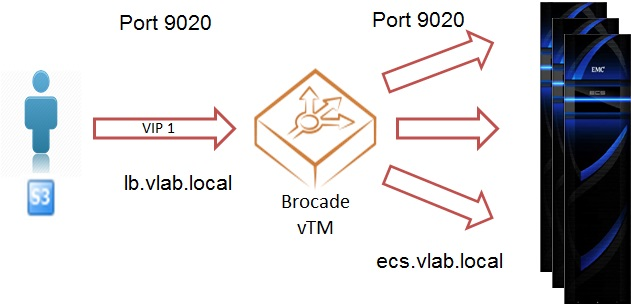
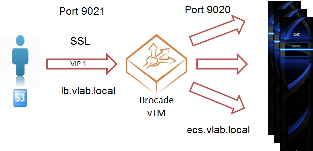
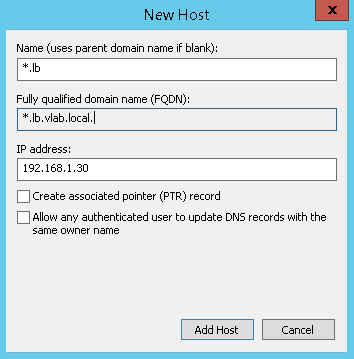
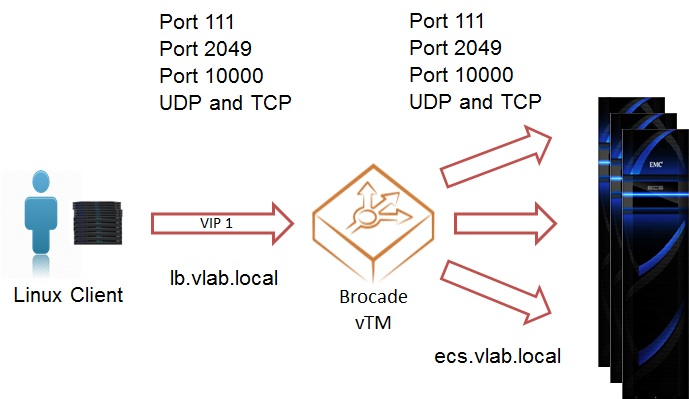
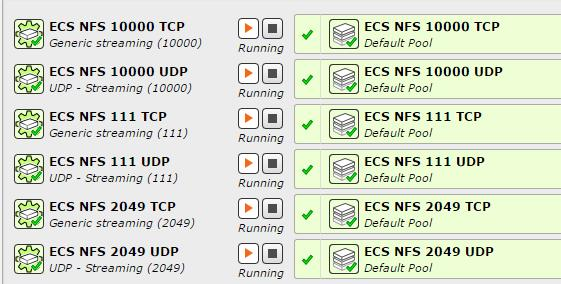
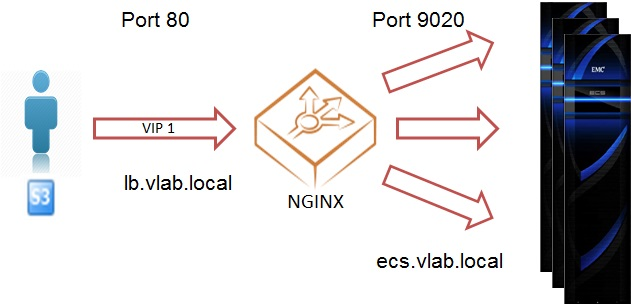
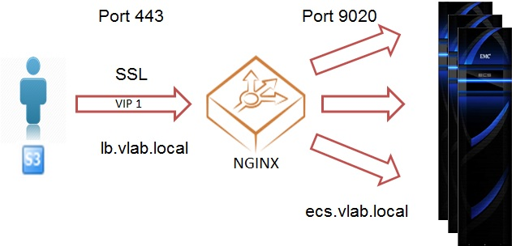

# Load Balancer vLab #
---
DellEMC Elastic Cloud Storage (ECS) is a software-defined, cloud-scale, object storage platform that combines the cost advantages of commodity infrastructure with comprehensive protocol support for unstructured (Object and File) workloads.

It is a best practice to complement the ECS with a Load Balancer, especially when using S3 or NFS. 

This document focuses on how to deploy and configure Brocade vTM and NGNIX load balancers. However, most of the ideas described in this document can be applied to other load balancer models.

The goal of this lab is to learn how to configure Brocade Virtual Traffic Manager (vTM)  and NGNIX Load Balancers to provide high availability for different access methods (S3, NFS, …) and configurations (non-SSL, SSL).

## Prerequisites

### ECS

If you don't have access to an ECS system, you can create an account on [ECS Test Drive](http://portal.ecstestdrive.com).

For the lab, please use the provided ECS endpoints.

### Load Balancers 

The first half of the lab will be focused on Brocade load balancing, running in a container in your VM, listening requests at ports 9020/9021. Then you will switch to a NGNIX load balancer, also running in a Docker container, but listening requests at ports 80/443, to avoid conflicts. The pictures at the begging of each section illustrate what you try to achieve there.

For both Brocade and NGNIX , this lab covers simple S3 and NFS load balancing and SSL configuration in a single site. For more advanced configurations, please refer to the ECS POC test plan for [ECS & Brocade Load Balancers - ECS FastPass / Proof of Concept Test Plans in Inside EMC](https://inside.dell.com/docs/DOC-218468).

>**Note:** Please open the mentioned document as a reference, since it includes screenshots  that could help with the Brocade load balancer configuration.


# Lab


## Brocade vTM

### S3 Load Balancing

In this section, we'll configure a Brocade Load Balancer, running in a Docker Container in your VM. It will be mapped to the IP of your VM, port 9090.
The load balancer will listen requests at port 9020 and will redirect them to your ECS nodes, port 9020.



**Configuration tasks**

- Check the firewall of your VM, and stop it if needed.

```
systemctl status firewalld
systemctl stop firewalld
```

- Start the Docker container

```
docker run -e ZEUS_EULA=accept -e ZEUS_PASS=password --privileged -t --net=host -d djannot/brocade-vtm
```

- Launch the Brocade UI
    - `http://ip_vm:9090`
    - Login with admin/password and click on `Use developper mode`
- Create a pool using the ECS node IPs
	- Use the right port for S3 (9020)
	- Use the right Health Monitor (Simple HTTP)
- Create a Virtual Server, listening at port 9020, redirecting the traffic to the pool you just created
- Create a DNS Host record for your virtual server -> lb.vlab.local 
	- The ECS already has a DNS record (ecs.vlab.local)
	- You can launch the Domain Controller from mRemoteNG; it's already preconfigured.


**Verification**

- Use S3 browser to test you can access your data using both, an ECS node and the Virtual server (IP or DNS record) you just created
	- Storage Type: S3 compatible storage
	- Create an user/bucket in ECS
	- Access key ID =  ECS object user name
	- Secret Access key =  ECS secret key
	- REST endpoint = ECS node/Load Balancer:9020
	- Verity that S3 Browser is configured for HTTP
		- Browser Tools -> Options -> Connection -> Uncheck *Use Secure Transfer (HTTPS)*
	
### SSL configuration

In this section, we'll add SSL encryption to your Brocade Load Balancer configuration.

According to the ECS best practices, we'll offload the SSL complexity in the Load Balancer. This way, the communication between the application and the Load Balancer will be encrypted (in this case, Load Balancer listening at port 9021), but the communication between the Load Balancer and your ECS nodes will be non-encrypted (port 9020). 



**Configuration tasks**

- [Optional] - Some applications, like CloudArray, use Virtual Style Addressing. In that case, a wildcard for the load balancer name is needed.
	- Create a wildcard **.lb.vlab.local* and verify that you can ping *bucket.lb.vlab.local*
	- You can launch the Domain Controller from mRemoteNG; it's already preconfigured.

>

- Modify your Virtual Server configuration to use SSL. 
	- Listening at port 9021 (HTTP) 
	- Enable SSL Decryption and create a certificate
		- Manage SSL certificates -> Create Self-Signed Certificate -> Certificate Signing Request. 
		- The Name should be *lb.vlab.local* and the *Common Name* should match with the *wildcard* (*.lb.vlab.local).

**Verification**

- Use S3 browser to test you can access your data using port 9021
	- Modify the REST endpoint configuration in your S3 Browser account = lb.vlab.local:9021
	- Verity that S3 Browser is configured for HTTPS
		- Browser Tools -> Options -> Connection -> Check *Use Secure Transfer (HTTPS)*

>**Note:** When using ISVs, the certificate must be also loaded in the application, so that the communication between the application and the Load Balancer is encrypted. It is recommended to offload SSL at the Load Balancer level, but it is possible to also configure end-to-end SSL encryption.

### NFS Load Balancing

Several port, TCP and UDP, are involved when talking about NFS. In this case you will have to create several Virtual Servers, each one listening at one of these ports and redirecting the traffic to the ECS nodes, same port.



**Configuration tasks**

- Create Pools and Virtual Servers for the TCP and UDP ports used in NFS (111, 2049 and 10000). 
	- Configure TCP Virtual Servers as *Generic Streaming* 
	- Configure UDP Virtual Servers as *UDP - Streaming*
	
> At the end you should get something like this:

> 

- Configure sticky sessions in your NFS pools
	- Create a session persistence configuration at the IP level and associate it with your NFS pools.

**Verification**

- Use your Linux client and mount your ECS export using the Virtual Server you just created.

## NGINX

### S3 Load Balancing

In this section, we'll configure a NGNIX Load Balancer, running in a Docker Container in your VM. The new NGNIX will listen requests at port 80 and will redirect them to your ECS nodes, port 9020.



**Configuration tasks**

- Disable selinux by executing the `su -c "setenforce 0"` command to avoid a permission issue in the Docker container
- Create a `/root/nginx` directory
- Create the `/root/nginx/nginx.conf` file with the following content:
```
worker_processes 4;

events {
}

http {

  upstream ecs {
    server 192.168.1.11:9020;
    server 192.168.1.12:9020;
    server 192.168.1.13:9020;
  }

  server {
    listen 80;

    location / {
      sendfile on;
      tcp_nopush on;
      tcp_nodelay on;
      client_max_body_size 1024G;
      proxy_buffering off;
      proxy_buffer_size 4k;
      proxy_pass http://ecs;
      proxy_set_header Host $host;
      proxy_set_header X-Real-IP $remote_addr;
      proxy_set_header X-Forwarded-For $proxy_add_x_forwarded_for;
      proxy_set_header X-Forwarded-Proto $scheme;
    }
  }
}

```  
- Start the Docker container

```
docker run --net=host --name nginxlb -v /root/nginx:/etc/nginx -d nginx
```

**Verification**

- Use S3 browser to test that you can access your data using port 80
	- Modify the REST endpoint configuration in your S3 Browser account = lb.vlab.local:80
	- Verity that S3 Browser is configured for HTTP
		- Browser Tools -> Options -> Connection -> Uncheck *Use Secure Transfer (HTTPS)*

### SSL configuration

In this section, we'll add SSL encryption to your Brocade Load Balancer configuration. Your new NGNIX will listen requests at port 443, it will offload the SSL complexity, and it will redirect them to the ECS nodes, port 9020.



**Configuration tasks**

- Create a `/root/nginx/ssl` directory
- Create a certificate for the Common Name **.lb.vlab.local*
	- You can either create a new certificate using OpenSSL
		- /etc/nginx/ssl/server.crt
		- /etc/nginx/ssl/server.key
	- Or reuse the certificate you created in the previous section with Brocade.
		- In order to get the certificate created in the vTM, run
			`docker ps` -> Get the containier ID
			`docker cp <container id>:/usr/local/zeus/zxtm-11.0/conf_A/ssl/server_keys/lb.vlab.local.public /root/nginx/ssl/server.crt`
			`docker cp <container id>:/usr/local/zeus/zxtm-11.0/conf_A/ssl/server_keys/lb.vlab.local.private /root/nginx/ssl/server.key`

- Add the following lines to the `server` section of the `nginx.conf` file:

```
listen 443 default_server ssl;
ssl_certificate         /etc/nginx/ssl/server.crt;
ssl_certificate_key     /etc/nginx/ssl/server.key;
```

- Restart the Docker container

```
docker restart nginxlb
```

**Verification**

- Use S3 browser to test that you can access your data using port 443
	- Modify the REST endpoint configuration in your S3 Browser account = lb.vlab.local:443
	- Verity that S3 Browser is configured for HTTPS
		- Browser Tools -> Options -> Connection -> Check *Use Secure Transfer (HTTPS)*

## References

- [ECS & Brocade Load Balancers - ECS FastPass / Proof of Concept Test Plans, Inside EMC](https://inside.dell.com/docs/DOC-218468)
- [Brocade vTM website](http://www.brocade.com/en/products-services/software-networking/application-delivery-controllers/virtual-traffic-manager.html)

