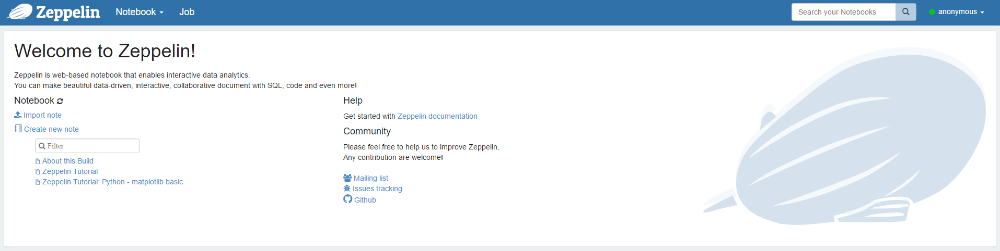
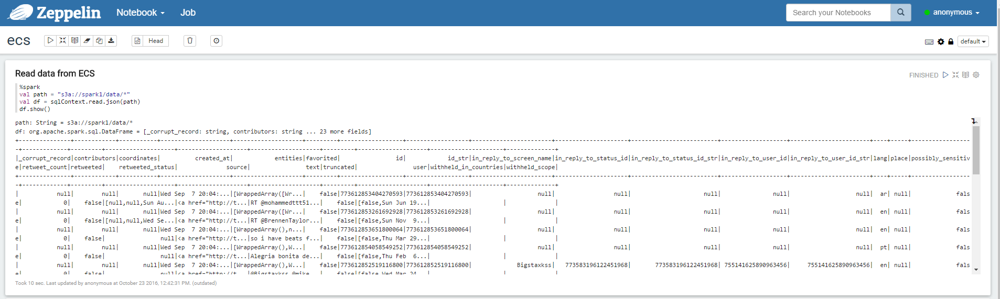

# Using Apache Spark to analyze data stored on ECS using s3a

DellEMC Elastic Cloud Storage (ECS) is a software-defined, cloud-scale, object storage platform that combines the cost advantages of commodity infrastructure with comprehensive protocol support for unstructured (Object and File) workloads.

ECS supports several Object Storage APIs (Amazon S3, Openstack Swift, Atmos, CAS), but the Amazon S3 API is by the far the most popular.

Data stored using the Amazon S3 API can also be accessed through NFS or HDFS, and vice versa.
But a new Hadoop Compatible File System (HCFS), called *s3a*, has been introduced recently.

*s3a* can be used to use native S3 buckets in most of the big data analytic frameworks, including Apache Spark.

Apache Spark is a fast and general engine for large-scale data processing (by their own definition).

We will use Spark to analyze tweets in JSON format and we will also leverage Apache Zeppelin, a web-based notebook that enables interactive data analytics. 

## Prerequisites

### ECS

If you don't have access to an ECS system, you can create an account on [ECS Test Drive](http://portal.ecstestdrive.com).

Create an Amazon S3 bucket called *spark1* using a tool like [S3 Browser](http://www.s3browser.com). You need to upload the file called `tweets.json` in the bucket. This file is available in the Github repo.

### Apache Spark

I created a Docker container with Apache Spark 2.0, Zeppelin and Hadoop 3.0.

Hadoop 3.0 is needed as it includes major *s3a* bug fixes.

Pull the container image using the command below:

```
docker pull djannot/docker-zeppelin
```

You can then start the container with the following command:

```
docker run -it -p 8080:8080 djannot/docker-zeppelin bash
```

You're now inside the Docker container.

Install *vim* to be able to edit the configuration file later:
```
apt-get update
apt-get install vim
```

Go to `/usr/hadoop-3.0.0-alpha1/lib` and run the command below to download the Amazon S3 SDK:

```
wget http://central.maven.org/maven2/com/amazonaws/aws-java-sdk/1.7.4/aws-java-sdk-1.7.4.jar
```

After that, go to `/usr/hadoop-3.0.0-alpha1/etc/hadoop` and edit the `core-site.xml` file as follows:

```
<configuration>
<property>
  <name>fs.s3a.impl</name>
  <value>org.apache.hadoop.fs.s3a.S3AFileSystem</value>
</property>
<property>
  <name>fs.s3a.access.key</name>
  <value>ACCESSKEY</value>
</property>
<property>
  <name>fs.s3a.secret.key</name>
  <value>SECRETKEY</value>
</property>
<property>
  <name>fs.s3a.endpoint</name>
  <value>https://object.ecstestdrive.com</value>
</property>
<property>
  <name>fs.s3a.connection.ssl.enabled</name>
  <value>enabled</value>
</property>
<property>
  <name>fs.s3a.signing-algorithm</name>
  <value>S3SignerType</value>
</property>
</configuration>
```

You need to replace *ACCESSKEY* and *SECRETKEY* by your own credentials.

If you are using your own ECS system, then you need to indicate the corresponding endpoint (for example, *http://ip:9020*) and to disable SSL if you don't want to use HTTPS.

Finally go to `/usr/zeppelin` and execute the `bin/zeppelin.sh` command to start Apache Zeppelin.

The Zeppelin UI can now be accessed with a web browser on port 8080.



Click on *Import note* to import the file called `ecs.json`. This file is available in the Github repo.

## Lab

### Load data from the S3 bucket

In the Zeppelin notebook you've just imported, run the paragraph.

It will read the objects under the *data* directory in your S3 bucket, parse the content and show the dataframe.



### Next steps

You can now simply follow the instructions in the next Zeppelin paragraphs.